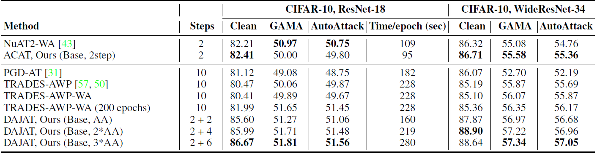
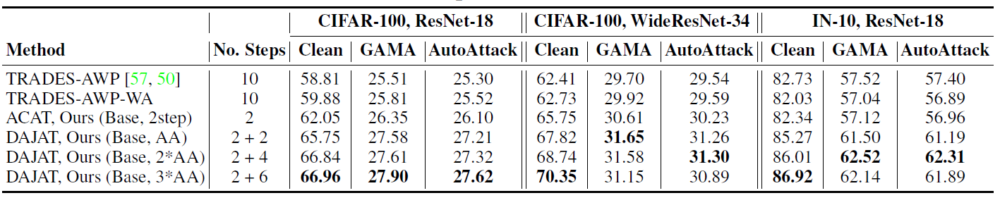

# Efficient and Effective Augmentation Strategy for Adversarial Training
This repository contains codes for the training and evaluation of our NeurIPS-22 paper  [Efficient and Effective Strategy for Adversarial Training](https://arxiv.org/abs/2210.15318). The openreview link for the paper is also  [available](https://openreview.net/forum?id=ODkBI1d3phW).


 # Environment Settings 
* Python 3.6.9
* PyTorch 1.8
* Torchvision 0.8.0
* Numpy 1.19.2

The checkpoints can be found at [Google Drive]()
# Training
For training DAJAT: 
```
python train_DAJAT.py --use_defaults ['NONE','CIFAR10_RN18', 'CIFAR10_WRN','CIFAR100_WRN', 'CIFAR100_RN18']
```
For training ACAT: 
```
python train_DAJAT.py --use_defaults ['NONE','CIFAR10_RN18', 'CIFAR10_WRN','CIFAR100_WRN', 'CIFAR100_RN18']  --num_autos 0 --epochs 110 --beta
```
# Evaluation
The GAMA-PGD-100 evaluation code is provided in eval.py.
For evaluation of the trained model: 
```
python eval.py --trained_model 'PATH OF TRAINED MODEL' 
```
Further all the running details are provided in run.sh. It is recommended to use this file for training and evaluation of DAJAT.

# Results



Results obtained using higher number of attack steps and 200 epochs for training:
<p float="left">
  
</p>

# Citing this work
```
@inproceedings{
addepalli2022efficient,
title={Efficient and Effective Augmentation Strategy for Adversarial Training},
author={Sravanti Addepalli and Samyak Jain and Venkatesh Babu Radhakrishnan},
booktitle={Advances in Neural Information Processing Systems},
editor={Alice H. Oh and Alekh Agarwal and Danielle Belgrave and Kyunghyun Cho},
year={2022},
url={https://openreview.net/forum?id=ODkBI1d3phW}
}
```
